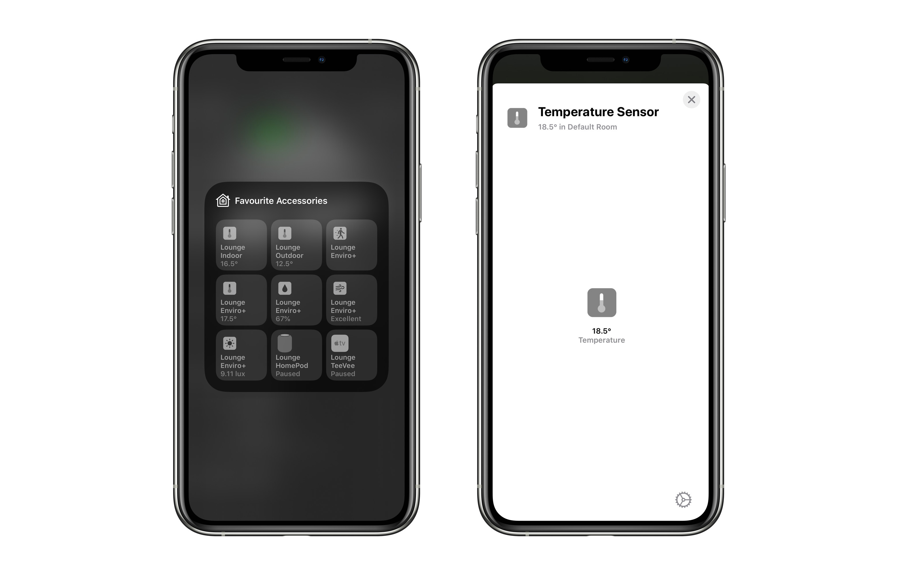

# HomeKit Oregon Scientific IDTW211R
An [Apple HomeKit](https://developer.apple.com/homekit/) accessory for the [IDTW211R](https://oregonshop.com.au/emr211-bluetooth-low-energy-indoor-outdoor-thermometer/) running on a Raspberry Pi.

## Dependencies

* [**Go**](http://golang.org/doc/install) - this accessory is written in Go
* [**HomeControl**](https://github.com/brutella/hc) - to expose climate readings from the IDTW211R as an Apple HomeKit accessory
* [**oregon-temperature-prometheus**](https://github.com/sighmon/oregon-temperature-prometheus) - to read the sensors of the IDTW211R and export them for scraping by [Prometheus](https://prometheus.io)

## Installation

Install this on a Raspberry Pi, or test it on macOS.

### Setup

1. Install [Go](http://golang.org/doc/install) >= 1.14 ([useful Gist](https://gist.github.com/pcgeek86/0206d688e6760fe4504ba405024e887c) for Raspberry Pi)
1. Clone this project: `git clone https://github.com/sighmon/homekit-oregon-temperature` and then `cd homekit-oregon-temperature`
1. Install the Go dependencies: `go get`
1. Install and run the Prometheus exporter [oregon-temperature-prometheus](https://github.com/sighmon/oregon-temperature-prometheus)

### Build

1. To build this accessory: `go build homekit-oregon-scientific-idtw211r.go`
1. To cross-compile for Raspberry Pi on macOS: `env GOOS=linux GOARCH=arm GOARM=7 go build homekit-oregon-scientific-idtw211r.go`

### Run

1. Execute the executable: `./homekit-oregon-scientific-idtw211r`
1. Or run with the command: `go run homekit-oregon-scientific-idtw211r.go`

### Optional flags

The flag defaults can be overridden by handing them in at runtime:

* `-host=http://0.0.0.0` The host of your IDTW211R sensor
* `-port=1006` The port of your IDTW211R sensor
* `-sleep=5s` The [time](https://golang.org/pkg/time/#ParseDuration) between updating the accessory with sensor readings (`5s` equals five seconds)
* `-dev` This turns on development mode to return a random temperature reading without needing to have an IDTW211R

e.g. to override the port run: `go run homekit-oregon-scientific-idtw211r.go -port=8000` or `./homekit-oregon-scientific-idtw211r -port=8000`

## Reset this accessory

If you uninstall this accessory from your Apple Home, you'll also need to delete the stored data for it to be able to be re-added.

### macOS

1. Delete the data in the folder created: `homekit-oregon-scientific-idtw211r/Thermometer/`
1. Restart the executable

### Raspberry Pi

1. Remove the persistent data: `rm -rf /var/lib/homekit-oregon-scientific-idtw211r/data`
1. Restart the Raspberry Pi

## Thanks

Based on: https://github.com/sighmon/homekit-enviroplus

This project uses the amazing work of [Matthias](https://github.com/brutella). Please consider donating if you found this useful.
